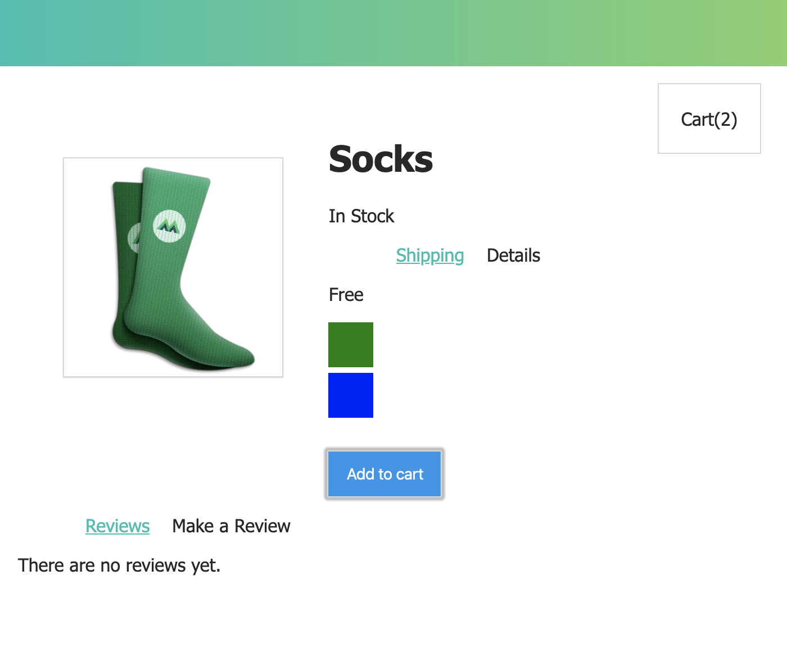
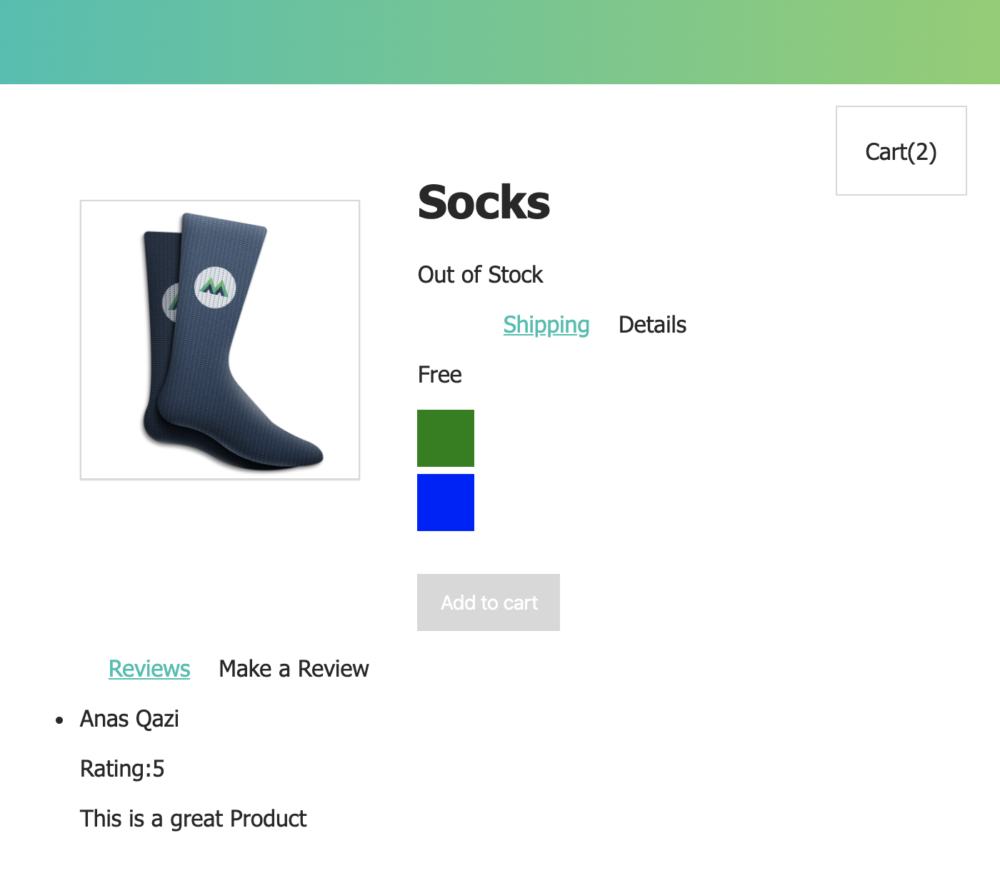

# INTRO TO VUE.js 

This page is built using the introduction to vue.js tutorials. The video tutorials covers the following topics : 

1. Creating the Vue instance 
2. Attribute Binding
3. Conditional Rendering
4. List Rendering
5. Event Handling 
6. Class & Style Binding
7. Computed Properties
8. Creating Components
9. Communicating Events 
10. Forms 
11. Tabs 

Feel free to use the code from the links provided below. 

## Links / Resources / API's USED

**[GITHUB PAGES](https://ianasqazi.github.io/vue-intro/)** 

**[GITHUB REPO](https://github.com/ianasqazi/vue-intro)** 

**[COVID API  - DATA 1](https://docs.corona.lmao-xd.wtf/version-2)** 

**[COVID API  - DATA 2](https://documenter.getpostman.com/view/2568274/SzS8rjbe?version=latest2)** 

**[DEV COMMUNITY POST](https://dev.to/alemesa/how-to-create-a-covid-19-map-with-mapbox-and-react-3jgf)** 

## Libraries/Frameworks Used 

1. REACT : "^16.12.0"
2. REACT-DOM : "^16.12.0"
3. REACT-ROUTER-DOM : "^5.1.2"
4. REACT-SCRIPT : "3.4.0"
5. REACTSTRAP : : "^8.4.1"
6. REACT-LOADINGG : "^1.7.2"
7. MAPBOX-GL : "^1.9.1"
8. AXIOS : "^0.19.2"
9. SWR : "^0.2.0"
10. COUNTRY-CODE-LOOKUP : "^0.0.17"
11. COMMA-NUMBER : "^2.0.1"

